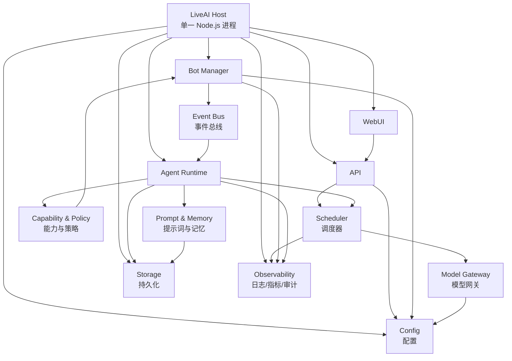
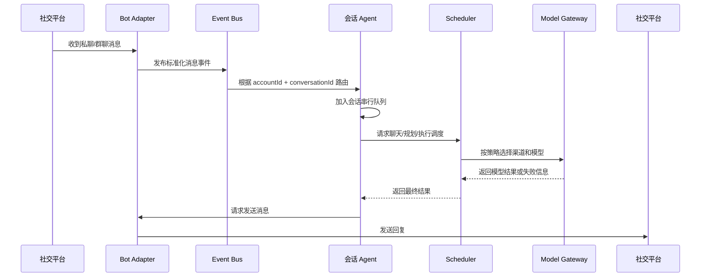

# LiveAI

> 让 AI 活在你的社交账户上。

使用了那么多 Agent，工作量却与日俱增？社交消息繁忙，几乎没有完整、不被打扰的时间认真做一件事情？在快节奏的时代，如何享受一个下午的慢生活，又不怕与时代脱节？

是时候把自己蒸馏成 Agent，来应对纷繁的世界。

LiveAI 希望把 AI 从一个需要被反复打开的聊天窗口，变成真正生活在社交账户上的数字代理。它负责接收消息、理解上下文、调用模型、管理账户，并在明确的权限边界内替你处理重复而繁琐的事情。

> 当前已完成：Phase 0 宿主骨架，以及从旧版 Python 架构移植的完整聊天运行时（NapCat/OneBot 适配、作用域串行管线、插队合并、提示词分层、模型渠道、JSON 持久化、聊天工具集）。WebUI 与提示词评估仍在路线图上。

## 项目目标

LiveAI 是一个由单一宿主进程管理的模块化 Node.js 应用，连接以下几类能力：

- 社交账户和 Bot 连接
- 多个模型渠道、上游服务和模型
- Web 管理界面与开放 API
- 账户级主 AI 和会话级 Agent
- 可配置的提示词、人格和行为策略

项目的核心目标不是让用户配置更多自动化规则，而是让一个主 AI 帮助完成配置，再由多个职责清晰的 Agent 在日常社交环境中持续工作。

## 非目标

早期版本不会以这些目标为优先事项：

- 一开始就拆分成多个微服务
- 一开始覆盖所有 IM 平台和所有模型供应商
- 允许 Agent 无限制地执行账户操作
- 用一套固定提示词解决所有人格和场景问题
- 在没有观测数据的情况下过早优化调度算法

LiveAI 首先需要拥有一个稳定、可观测、能够优雅启动和关闭的宿主，再逐步增加连接器与智能能力。

## 核心功能

### 1. WebUI

WebUI 是配置和观察 LiveAI 的主要入口，目标能力包括：

- 查看和配置模型渠道、上游服务与模型
- 配置 Bot 的连接方式，例如 OneBot / NapCat
- 管理多个社交账户和多个 Bot 连接
- 管理模型能力、优先级、权重和降级关系
- 查看会话、任务、调用记录和运行状态
- 由首页主 AI 辅助完成配置、诊断和日常操作

WebUI 不直接操作 Bot 连接或模型供应商，而是通过 API 调用宿主内的领域服务。

### 2. API 模块

API 模块提供 WebUI、外部客户端和内部模块使用的统一入口，目标能力包括：

- 账户、Bot、模型渠道和模型配置
- 聊天请求与流式响应
- 规划任务和执行任务
- 渠道选择、失败降级和调用重试
- 多模型混合与随机调度
- 运行状态、日志、审计和健康检查

API 负责协议、鉴权和输入输出转换；具体的模型选择、Agent 调度和账户能力由对应领域模块负责。

### 3. Bot 模块

Bot 模块负责连接和管理社交账户，初期以 OneBot 生态为主要目标：

- 支持多个 Bot 账户
- 支持多个 OneBot 上游或连接方式
- 统一接收私聊、群聊、好友请求、群请求等事件
- 统一发送消息和调用账户动作
- 管理连接状态、重连、心跳和能力发现
- 将平台差异转换成 LiveAI 内部事件

Bot 适配器只负责连接和协议，不负责决定 AI 应该说什么或是否允许某项账户操作。

### 4. Agent 模块

每个 Bot 账户拥有一个负责管理该账户的账户主 AI。账户主 AI 可以在权限允许的范围内：

- 处理账户相关的配置和状态
- 识别并管理好友、群组和请求
- 发起加好友、加群、同意请求等账户操作
- 与 LiveAI 主 AI 对话
- 为下属会话 Agent 提供账户级策略和上下文

每个用户或群聊对应一个单线程会话 Agent：

- 同一账户、同一会话内的消息严格按顺序处理
- 不同会话之间可以并发处理
- 会话 Agent 拥有稳定的上下文边界
- 会话 Agent 不能绕过能力层直接操作账户连接

“单线程”指会话级处理队列，不意味着整个 LiveAI 进程只能同时处理一个请求。

### 5. 提示词工程

LiveAI 的目标不是让 AI 机械地回复消息，而是让它在社交环境中表现得稳定、自然并且可控。提示词系统将逐步覆盖：

- 账户人格、身份和表达风格
- 私聊、群聊和账户管理场景
- 长期记忆、短期上下文和会话摘要
- 消息优先级、打断和延迟行为
- 工具调用前的判断、确认和权限检查
- 不同模型能力下的行为一致性
- 提示词版本、评估样例和回归测试

提示词不是权限系统。任何可能影响账户、隐私或外部用户的动作，都必须经过独立的能力和策略层。

## 核心概念

| 概念 | 说明 |
| --- | --- |
| 宿主进程 | LiveAI 的唯一主进程，负责模块注册、生命周期、配置和基础设施 |
| 账户 | 一个可被 LiveAI 管理的社交身份，通常对应一个 Bot 登录身份 |
| Bot 连接 | 账户与 OneBot 或其他平台连接方式之间的适配器实例 |
| 渠道 | 一组模型服务配置和连接能力，例如某个 API 服务商 |
| 上游 | 渠道中的具体服务端点、凭据和可用模型集合 |
| 模型 | 具有名称、能力、上下文限制、价格和调度属性的模型实体 |
| 调度策略 | 决定某个请求由哪些模型、渠道和执行模式处理的规则 |
| 账户主 AI | 管理一个 Bot 账户的 Agent，拥有账户级上下文和受控能力 |
| 会话 Agent | 服务一个用户或群聊的串行 Agent，拥有独立会话上下文 |
| 能力 | Agent 可以请求的明确动作，例如发消息、加好友或同意请求 |
| 会话 | 由账户和用户/群聊标识共同确定的上下文与处理队列 |

## 总体架构

LiveAI 采用模块化单体架构：所有核心模块先运行在同一个 Node.js 进程内，通过明确的服务接口和进程内事件总线协作。这样可以先获得简单的部署、调试和状态管理方式，未来再根据真实负载拆分独立服务。



### 宿主进程职责

宿主进程是所有模块的生命周期边界，负责：

1. 加载并校验配置
2. 创建日志、事件总线、存储和模型网关等基础设施
3. 按顺序初始化各个模块
4. 恢复需要恢复的连接和会话
5. 暴露健康检查与运行状态
6. 响应退出信号并按依赖逆序关闭模块
7. 确保后台连接、定时器和任务都能被追踪和释放

模块不应自行创建无法由宿主管理的后台进程、连接或线程。

## 典型消息流程



### 调度要求

调度器需要把“请求应该怎么完成”和“请求由哪个模型完成”分开处理。目标调度维度包括：

- 任务类型：聊天、规划、执行、总结、工具调用
- 模型能力：文本、视觉、长上下文、结构化输出等
- 渠道优先级和权重
- 模型混合或随机策略
- 超时、限流、余额和健康状态
- 失败后的降级链路
- 账户或会话的专属策略

模型渠道不可用时，调度器应按照可观测的策略进行降级，而不是让每个调用方自行实现一套重试逻辑。

## Agent 与账户能力

Agent 的智能决策和账户动作必须分层：

```text
Agent 判断意图
  -> 请求某项 Capability
  -> Policy 检查账户、会话、风险和确认要求
  -> Bot Adapter 执行平台动作
  -> 记录结果与审计事件
```

例如，加好友、加群、同意好友请求、邀请成员、批量发消息等操作，都应具备：

- 明确的能力名称和参数 schema
- 调用来源和会话身份
- 允许的账户范围
- 风险等级
- 是否需要用户确认
- 成功、失败和撤销状态
- 审计记录

提示词可以引导 Agent 选择能力，但不能将任意文本直接当成平台 API 参数执行。

## 建议目录结构

第一阶段目标结构如下。目录会随实现逐步创建，不提前为尚未实现的功能制造空模块。

```text
liveai/
├── package.json
├── pnpm-lock.yaml
├── tsconfig.json
├── .env.example
├── README.md
├── src/
│   ├── main.ts                    # 进程入口
│   ├── host/                      # 宿主生命周期、模块注册、关闭流程
│   ├── config/                    # 配置 schema、加载与热更新
│   ├── api/                       # API、鉴权、请求转换
│   ├── webui/                     # WebUI 集成
│   ├── bot/                       # Bot 管理、OneBot 适配器、账户连接
│   ├── agent/                     # 账户主 AI、会话 Agent
│   ├── model/                     # 渠道、上游、模型与模型网关
│   ├── scheduler/                 # 路由、降级、混合和任务调度
│   ├── prompt/                    # 提示词、人格、上下文与评估
│   ├── capability/                # 账户能力、策略和确认
│   ├── session/                   # 会话键、队列、上下文与持久化
│   ├── storage/                   # Repository 接口和数据库实现
│   ├── events/                    # 进程内事件定义与事件总线
│   └── observability/             # 日志、指标、审计追踪
├── tests/
│   ├── unit/
│   └── integration/
└── docs/
    └── decisions/
```

### 模块边界

| 模块 | 负责 | 不负责 |
| --- | --- | --- |
| `host` | 启停顺序、依赖注入、生命周期 | 业务决策 |
| `config` | 配置读取、校验、更新 | 保存运行时秘密到日志 |
| `api` | HTTP/WebSocket 协议、鉴权、DTO | 直接连接模型或 Bot |
| `webui` | 管理界面 | 绕过 API 修改状态 |
| `bot` | 平台协议、连接、消息收发 | 生成 AI 回复 |
| `agent` | 上下文、意图、Agent 循环 | 绕过能力层执行账户操作 |
| `model` | 供应商适配、模型调用 | 决定业务权限 |
| `scheduler` | 路由、降级、混合调度 | 保存各会话的私有上下文 |
| `capability` | 能力定义、策略、确认和审计 | 解释自然语言意图 |
| `storage` | 持久化抽象与实现 | 在模块间偷偷共享可变状态 |
| `events` | 标准化事件和发布订阅 | 承担复杂业务编排 |
| `observability` | 日志、指标、追踪和审计 | 记录密钥、完整隐私内容 |

## 会话串行模型

会话队列的逻辑键为：

```text
conversationKey = accountId + ":" + conversationId
```

其中 `conversationId` 需要区分私聊和群聊，不能只使用用户 ID。目标行为是：

- 同一个 Bot 账户的同一个私聊或群聊严格串行
- 不同会话可以并发
- 会话执行失败不会阻塞其他会话
- 进程重启后可以根据策略恢复或放弃未完成任务
- 队列长度、等待时间和失败原因可观测

单线程会话优先保证上下文一致性和人类式行为，再考虑进一步的并行优化。

## 配置与安全原则

### 配置原则

- 模型渠道配置、账户配置和运行时状态分开
- 凭据通过环境变量或安全存储注入
- 配置在进入业务模块前完成 schema 校验
- 配置变更通过统一服务生效，并产生审计事件
- 不让 WebUI 直接修改内存中的任意对象

### 安全原则

- API、WebUI 和 Bot 管理接口都需要明确的鉴权边界
- 模型密钥、Bot 凭据和用户隐私不能写入普通日志
- 群聊上下文必须与其他会话隔离
- 工具参数必须使用结构化 schema 校验
- 高风险账户动作默认需要确认或显式授权
- 敏感动作记录最小必要的审计信息
- 外部模型返回的内容不能自动获得更高权限

## 开发路线

### Phase 0：文档与宿主骨架

- 固化模块边界和核心领域概念
- 初始化 Node.js + TypeScript 工程
- 实现宿主启动、模块注册和优雅关闭
- 建立配置、日志、事件总线和健康检查接口

### Phase 1：配置、模型渠道与 API

- 增加模型渠道、上游和模型配置
- 实现统一 Model Gateway
- 实现基础聊天 API
- 加入超时、错误分类、降级和调用记录

### Phase 2：OneBot 多账户

- 实现 OneBot 连接适配器
- 支持多个 Bot 账户和连接实例
- 统一处理私聊、群聊和请求事件
- 加入连接状态、重连和能力发现

### Phase 3：Agent 与串行会话

- 实现账户主 AI
- 实现用户/群聊会话 Agent
- 实现会话队列和上下文持久化
- 实现能力、策略、确认和审计层

### Phase 4：WebUI 与提示词评估

- 实现模型、Bot、账户和策略配置界面
- 增加主 AI 配置助手
- 建立人格、场景和行为回归样例
- 增加运行状态、会话和调度观测界面

## 当前实现：聊天运行时（Phase 1–3 核心）

在 Phase 0 宿主之上，已经移植了旧版架构验证过的完整聊天链路。

### 作用域串行管线（`src/scope/`）

- `EventEnvelope` / `InMemoryEventMailbox`：按 `group:<id>` / `private:<id>` 分队列的 FIFO 邮箱；失败重试的条目回到队头且退避期间整个作用域停车，顺序永不乱
- `CharacterSession` + `ScopeActorDispatcher`：每个会话一个单消费者 actor，同会话严格串行、跨会话并发
- `AtomicTurnBatchCoordinator` + `turnItemFromBatch`：一轮结束后原子排空邮箱，把积压消息合并成一个续跑回合（突发 N 条 → 只触发 1 次补充模型调用）

### 聊天插队语义（`src/chat/orchestrator.ts`）

从旧版 `_run_message_turn` / `_merge_followup_after_turn` 移植的核心行为：

1. 作用域忙时新消息只入队，绝不打断进行中的模型调用
2. 工具循环的每轮之间排空邮箱：新消息折叠成下一轮触发消息，`deferredCount` 上升触发「补审提醒」，旧草稿作废、已发消息进入历史续接
3. 回合结束后再排空一次：合并成一个后续回合；全是静默事件则跳过
4. `messageEpoch` 全局失效与按时间戳的 stale 丢弃在所有边界生效
5. 异常时把「已执行完并生效的工具清单」写进历史中断备注，下一轮不会误以为没发生过

### 触发判定（`src/chat/trigger.ts`）

私聊必回 → @必回 → 触发词 → 概率（默认 0.01）。群聊防抖：未触发消息开启 60s 倾听窗口，静默 5s 且作用域空闲时合成续聊触发——旧版「像真人一样在群里自然接话」的机制。触发配置由模型自己用 `trigger_config` 工具调整（set_rate 设 0~1 接话率、add_word/remove_word 增删触发词），按会话持久化；群聊背景块会带上当前设置和「还没融入就尽量少说话」的提醒。

### 提示词系统（`data/prompt/` + `src/prompt/`）

- 分层文件：`char.txt` 人设、`char_prefill` 人设确认、`staff/10-50` 逐层拼接、`child_rules.txt` 25 条会话规则、`chat_focus` / `chat_style`
- system 块顺序与旧版一致：`[staff+身份基线+规则（可缓存）] → [动态背景（时间/会话/印象/摘要/补审提醒）] → [人设尾巴放最后避免稀释]`
- 消息协议：`<user_msg>` / `<user_invisible><tool_report>` / 短ID `[#A1B2]`；Anthropic 提示缓存断点在 system[0]、prefill 末尾与历史尾部前 4 条
- 发言必须走 `send_message` 工具，`stay_silent` 显式沉默，`<thinking>` 标签自动过滤

### 模型层（`src/models/`）

`models_config.json` 的 upstreams / channels / roles；策略 fallback / random / roundrobin / fallback_reset；tiered 角色回退；协议 anthropic / completions / responses；瞬时错误重试 3 次、400/422 单次丢弃 stream_options / reasoning、空内容抛错、thinking 强制 temperature=1.0。

### 持久化与记忆系统（`src/store/`）

模仿 openclaw 的记忆模型，「总结概括」和「精准检索」双轨并行：

**原始存档（`archive.ts`）**：每条消息（收到/发出/内部报告）同步追加进 per-scope 的 append-only JSONL（`data/state/archive/`），永不改写——这是精准检索的地基，即使活跃窗口滚动、摘要压缩，原话永远可查。

**分层总结（`repository.ts` + `summarizer.ts`）**：

- 50 条/段的日记分段 → 后台摘要任务浓缩成 150~300 字客观摘要（保留事件、约定、关系变化和可检索锚点）
- 每 3 个新分段 → 把旧「会话整体梗概」+ 新分段摘要合并重生成一份滚动 primer（openclaw compaction 的对应物），直接进背景提示词
- 摘要任务失败时原始分段留在队列里等重试；积压超过 10 段触发机械兜底摘要，绝不无限膨胀也绝不静默丢失；重启时自动扫描补跑

**背景提示词里的呈现**：整体梗概置顶 → 最近 3 段摘要 → 一句「更早细节用 memory_search 查，不要凭印象编造」。

**精准检索（`memory_search` 工具）**：

- `query` 空格分词 = AND 条件，`"引号"` = 精确短语；可按 `user_id`、`days`、`scope`（当前会话/全部会话）过滤，上限 50 条
- 命中带上下各一条上下文、时间戳、发言人、`[#短ID]`（可直接用于引用回复）
- 子串精确匹配不模糊、零运行时依赖（文件扫描，openclaw grep 后端同思路）

每会话状态文件（tmp+rename 原子写）：500 条活跃窗口、分段摘要（保留 20 段）、AI 备忘、跨重启的 4 位消息短ID映射。摘要走 `roles.summary` 渠道（未配置时自动回退 main），`ai.summary_enabled: false` 可整体关闭。

### 关系网络（`src/relations/`）

所有会话/群的子 AI 共享一张全局关系图谱（`data/state/relations.json`，原子写、串行落盘）：某人（QQ 号）在哪个群叫什么、出现在哪些会话、以及关于他的结构化情报。**在 A 群了解到的事，会出现在 B 群/私聊里这个人的档案上**——知识共享，但提示词带保密规则（不要说出"我在别的群看到你…"）。

**图谱（`graph.ts`）**：

- 人物：canonicalName（最新昵称）+ 各会话别名 + 出现的会话列表 + **整体印象** + 情报列表
- 情报：`subject + category(identity/preference/event/relationship/emotion/other) + text + confidence + 来源(会话/工具)`；同文去重只刷新置信度；**supersede/retract 代替删除**（审计轨迹保留）；每人上限 60 条 active，超出退役最旧的
- 会话：**印象（用途/氛围/关键人物，原 per-scope 印象已并入此处，启动时自动迁移旧值）** + 成员采样（≤40）+ 话题标签（≤12）
- 印象双写入口：子AI `impression_write`（当前会话印象）、主AI `relation_write`（人物/会话印象皆可）、自动抽取顺带刷新会话印象

**双通道采集**：

- **自动（`collector.ts`）**：每个会话每 20 条真实用户消息，后台把最近 24 条记录过一遍 `roles.summary` 渠道（temp 0.2，严格 JSON），抽取 ≤8 条情报 + 话题标签写进图谱。子 AI 完全不等待；失败提前重试（再攒 10 条就重跑），窗口更大成功率更高
- **手动（`intel_report` 工具）**：子 AI 在对话中主动上报确认过的事实；`relation_query` 反向查档案/搜情报/列成员——想不起来某人是谁时先查再答

**注入提示词**：发送者的人物卡（跨会话观察 + 置信度标注 + 保密规则）和本会话概况（印象 + 常聊话题 + 已知成员）进背景块；`ai.intel_enabled: false` 可关闭自动采集。

### 主AI协调层（master scope）

号主私聊作用域（`master_qq`）运行主AI：用 `main.txt` 职责定位而非聊天人设（无人设 prefill、规则不过滤、无聊天风格块），唤醒时自带**全局关系网络概览**（情报最多的人物 + 最活跃的会话）。

**工具集按作用域切换**（`chatToolSchemas(isMaster)`）：子AI 拿 `notify_master` / `intel_report` / `impression_write`；主AI 换成——

- `relation_write`：直接写关系网（人物印象/追加情报/取代/撤回/会话印象），录入置信度默认 1.0
- `delegate_to_child`：把指令注入目标会话的子AI（跨会话联系/转达一律走这里，子AI 自然与用户交流，完成后 notify_master 回报）
- `message_scope`：绕过子AI 直接向目标会话用户发消息（仅系统通知/紧急干预）
- 主AI 没有 `notify_master`（中继给自己会形成自环）

**闭环**：子AI `notify_master` → 中继进主AI作用域（`[子AI上报 from scope]`）→ 主AI归档/协调 → 主AI的纯文本结论自动**回传**来源会话（`[主AI回传]`，仅内部中继触发的回合，回主人的话绝不外漏）→ 委派任务的子AI回报再走 notify_master 回到主AI。工具结果门禁：子AI调到主AI专属工具会被拒绝并指回 notify_master。

### 聊天工具（`src/chat/tools.ts`）

`send_message`（唯一发言途径）、`stay_silent`、`recall_message`、`memory_list/write`、`notify_master`（中继到号主私聊作用域，号主作用域用 main.txt 主AI提示词）、`memory_search`（见记忆系统）、`intel_report` / `relation_query` / `impression_write`（见关系网络）、`trigger_config`（自调群聊触发率/触发词，见触发判定）。主AI作用域另有 `relation_write` / `delegate_to_child` / `message_scope`（见主AI协调层）。

### 任务调度（`src/chat/scheduler.ts`）

闹钟和周期任务**持久化**在 `data/state/tasks.json`（原子写），重启不丢：启动时恢复所有未触发任务，过期的立即补发。触发时回调编排器，往任务来源作用域注入内部消息（`[闹钟触发]` / `[周期任务触发]`）唤醒该会话的 AI 自主处理。

- `create_task`：`kind=set_alarm`（`at` 传 Unix 秒或 `+90s/+5m/+2h/+1d`）；`kind=recurring_task`（`every` 传间隔、最短 1 分钟，`note` 写每次要执行的完整指令）
- `list_tasks` / `cancel_task`：子AI只见本会话任务（取消他域任务会被拒并指回 notify_master）；主AI跨会话可见可管
- 长延迟定时器自动分段重武装（setTimeout 24.8 天上限）；已完成/取消任务保留审计（上限 200 条）

### 图片收发（`src/chat/images.ts` + `view_image`/`send_image` 工具）

**收**：入站消息从 OneBot 数组段和 `[CQ:image,...]` 码里解析图片 URL（`url=` 优先，http 的 `file=` 兜底，CQ 转义还原），存进历史/触发条目的 `image_refs`；文本位置留 `[图片×N]` 标记。背景块注入「本次消息包含 N 张图片」提示，模型按需调 `view_image`（默认看本轮第 index 张，或传 `message_ref` 看历史某条的图，`question` 指定关注点）——视觉走 `roles.vision` 渠道（未配置自动回退 main），三种协议都支持图片块（anthropic `image/url`、completions `image_url`、responses `input_image`）。**发**：`send_image` 传 http(s) 链接 / `base64://` / 本地绝对路径，走 NapCat 图片段，发出后落一条 `[图片]` 历史（带短ID可引用）。

## 本地开发

需要 Node.js 22+。项目使用 TypeScript，推荐使用 pnpm：

```bash
corepack enable
pnpm install
pnpm dev
```

验证工程：

```bash
pnpm typecheck
pnpm test
pnpm build
```

生产模式启动：

```bash
cp data/config.example.json data/config.json
cp data/models_config.example.json data/models_config.json
# 填入 NapCat 地址/token 与模型渠道后：
pnpm start
```

默认监听 `127.0.0.1:3000`，可以通过进程环境变量调整（env 优先于 data/config.json）：

```bash
LIVEAI_HOST=127.0.0.1
LIVEAI_PORT=3000
LIVEAI_LOG_LEVEL=info
LIVEAI_NAPCAT_WS_URL=ws://127.0.0.1:7821/openclaw-bind
LIVEAI_NAPCAT_HTTP_URL=http://127.0.0.1:7822
LIVEAI_NAPCAT_SELF_ID=0        # 0 = 从首个事件自动学习
LIVEAI_NAPCAT_TOKEN=...
LIVEAI_MASTER_QQ=241898129
```

健康检查：

```bash
curl http://127.0.0.1:3000/health
curl http://127.0.0.1:3000/ready
```

测试覆盖：作用域管线（FIFO/停车/顺序/并行）、提示词渲染与组装、触发判定与防抖（含 trigger_config 自调）、关系网络与主AI协调闭环、任务调度（持久化/补发/周期/取消）、图片解析与收发工具，以及端到端编排流（插队合并、回合后续合并、中断备注、闹钟回注、图片提示、群聊触发提示），共 94 例。

接入真实账户前，应先使用测试账户、最小权限和明确的测试群聊验证消息路由与能力策略。
