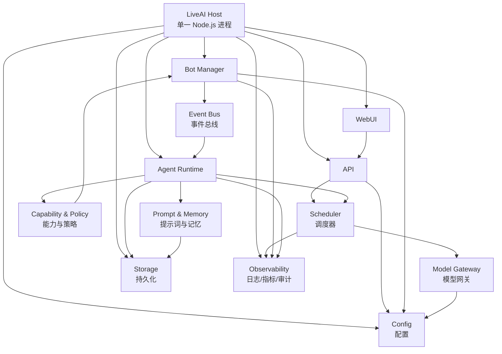
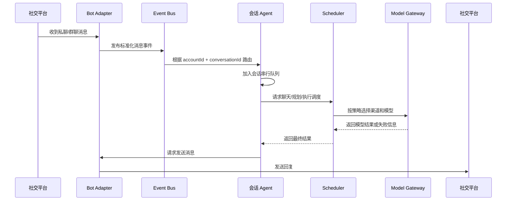

# LiveAI

> 让 AI 活在你的社交账户上。

使用了那么多 Agent，工作量却与日俱增？社交消息繁忙，几乎没有完整、不被打扰的时间认真做一件事情？在快节奏的时代，如何享受一个下午的慢生活，又不怕与时代脱节？

是时候把自己蒸馏成 Agent，来应对纷繁的世界。

LiveAI 希望把 AI 从一个需要被反复打开的聊天窗口，变成真正生活在社交账户上的数字代理。它负责接收消息、理解上下文、调用模型、管理账户，并在明确的权限边界内替你处理重复而繁琐的事情。

> 项目目前处于架构设计和早期开发阶段。本文描述目标架构，不代表所有功能已经实现。

## 项目目标

LiveAI 是一个由单一宿主进程管理的模块化 Node.js 应用，连接以下几类能力：

- 社交账户和 Bot 连接
- 多个模型渠道、上游服务和模型
- Web 管理界面与开放 API
- 账户级主 AI 和会话级 Agent
- 可配置的提示词、人格和行为策略

项目的核心目标不是让用户配置更多自动化规则，而是让一个主 AI 帮助完成配置，再由多个职责清晰的 Agent 在日常社交环境中持续工作。

## 非目标

早期版本不会以这些目标为优先事项：

- 一开始就拆分成多个微服务
- 一开始覆盖所有 IM 平台和所有模型供应商
- 允许 Agent 无限制地执行账户操作
- 用一套固定提示词解决所有人格和场景问题
- 在没有观测数据的情况下过早优化调度算法

LiveAI 首先需要拥有一个稳定、可观测、能够优雅启动和关闭的宿主，再逐步增加连接器与智能能力。

## 核心功能

### 1. WebUI

WebUI 是配置和观察 LiveAI 的主要入口，目标能力包括：

- 查看和配置模型渠道、上游服务与模型
- 配置 Bot 的连接方式，例如 OneBot / NapCat
- 管理多个社交账户和多个 Bot 连接
- 管理模型能力、优先级、权重和降级关系
- 查看会话、任务、调用记录和运行状态
- 由首页主 AI 辅助完成配置、诊断和日常操作

WebUI 不直接操作 Bot 连接或模型供应商，而是通过 API 调用宿主内的领域服务。

### 2. API 模块

API 模块提供 WebUI、外部客户端和内部模块使用的统一入口，目标能力包括：

- 账户、Bot、模型渠道和模型配置
- 聊天请求与流式响应
- 规划任务和执行任务
- 渠道选择、失败降级和调用重试
- 多模型混合与随机调度
- 运行状态、日志、审计和健康检查

API 负责协议、鉴权和输入输出转换；具体的模型选择、Agent 调度和账户能力由对应领域模块负责。

### 3. Bot 模块

Bot 模块负责连接和管理社交账户，初期以 OneBot 生态为主要目标：

- 支持多个 Bot 账户
- 支持多个 OneBot 上游或连接方式
- 统一接收私聊、群聊、好友请求、群请求等事件
- 统一发送消息和调用账户动作
- 管理连接状态、重连、心跳和能力发现
- 将平台差异转换成 LiveAI 内部事件

Bot 适配器只负责连接和协议，不负责决定 AI 应该说什么或是否允许某项账户操作。

### 4. Agent 模块

每个 Bot 账户拥有一个负责管理该账户的账户主 AI。账户主 AI 可以在权限允许的范围内：

- 处理账户相关的配置和状态
- 识别并管理好友、群组和请求
- 发起加好友、加群、同意请求等账户操作
- 与 LiveAI 主 AI 对话
- 为下属会话 Agent 提供账户级策略和上下文

每个用户或群聊对应一个单线程会话 Agent：

- 同一账户、同一会话内的消息严格按顺序处理
- 不同会话之间可以并发处理
- 会话 Agent 拥有稳定的上下文边界
- 会话 Agent 不能绕过能力层直接操作账户连接

“单线程”指会话级处理队列，不意味着整个 LiveAI 进程只能同时处理一个请求。

### 5. 提示词工程

LiveAI 的目标不是让 AI 机械地回复消息，而是让它在社交环境中表现得稳定、自然并且可控。提示词系统将逐步覆盖：

- 账户人格、身份和表达风格
- 私聊、群聊和账户管理场景
- 长期记忆、短期上下文和会话摘要
- 消息优先级、打断和延迟行为
- 工具调用前的判断、确认和权限检查
- 不同模型能力下的行为一致性
- 提示词版本、评估样例和回归测试

提示词不是权限系统。任何可能影响账户、隐私或外部用户的动作，都必须经过独立的能力和策略层。

## 核心概念

| 概念 | 说明 |
| --- | --- |
| 宿主进程 | LiveAI 的唯一主进程，负责模块注册、生命周期、配置和基础设施 |
| 账户 | 一个可被 LiveAI 管理的社交身份，通常对应一个 Bot 登录身份 |
| Bot 连接 | 账户与 OneBot 或其他平台连接方式之间的适配器实例 |
| 渠道 | 一组模型服务配置和连接能力，例如某个 API 服务商 |
| 上游 | 渠道中的具体服务端点、凭据和可用模型集合 |
| 模型 | 具有名称、能力、上下文限制、价格和调度属性的模型实体 |
| 调度策略 | 决定某个请求由哪些模型、渠道和执行模式处理的规则 |
| 账户主 AI | 管理一个 Bot 账户的 Agent，拥有账户级上下文和受控能力 |
| 会话 Agent | 服务一个用户或群聊的串行 Agent，拥有独立会话上下文 |
| 能力 | Agent 可以请求的明确动作，例如发消息、加好友或同意请求 |
| 会话 | 由账户和用户/群聊标识共同确定的上下文与处理队列 |

## 总体架构

LiveAI 采用模块化单体架构：所有核心模块先运行在同一个 Node.js 进程内，通过明确的服务接口和进程内事件总线协作。这样可以先获得简单的部署、调试和状态管理方式，未来再根据真实负载拆分独立服务。



### 宿主进程职责

宿主进程是所有模块的生命周期边界，负责：

1. 加载并校验配置
2. 创建日志、事件总线、存储和模型网关等基础设施
3. 按顺序初始化各个模块
4. 恢复需要恢复的连接和会话
5. 暴露健康检查与运行状态
6. 响应退出信号并按依赖逆序关闭模块
7. 确保后台连接、定时器和任务都能被追踪和释放

模块不应自行创建无法由宿主管理的后台进程、连接或线程。

## 典型消息流程



### 调度要求

调度器需要把“请求应该怎么完成”和“请求由哪个模型完成”分开处理。目标调度维度包括：

- 任务类型：聊天、规划、执行、总结、工具调用
- 模型能力：文本、视觉、长上下文、结构化输出等
- 渠道优先级和权重
- 模型混合或随机策略
- 超时、限流、余额和健康状态
- 失败后的降级链路
- 账户或会话的专属策略

模型渠道不可用时，调度器应按照可观测的策略进行降级，而不是让每个调用方自行实现一套重试逻辑。

## Agent 与账户能力

Agent 的智能决策和账户动作必须分层：

```text
Agent 判断意图
  -> 请求某项 Capability
  -> Policy 检查账户、会话、风险和确认要求
  -> Bot Adapter 执行平台动作
  -> 记录结果与审计事件
```

例如，加好友、加群、同意好友请求、邀请成员、批量发消息等操作，都应具备：

- 明确的能力名称和参数 schema
- 调用来源和会话身份
- 允许的账户范围
- 风险等级
- 是否需要用户确认
- 成功、失败和撤销状态
- 审计记录

提示词可以引导 Agent 选择能力，但不能将任意文本直接当成平台 API 参数执行。

## 建议目录结构

第一阶段目标结构如下。目录会随实现逐步创建，不提前为尚未实现的功能制造空模块。

```text
liveai/
├── package.json
├── pnpm-lock.yaml
├── tsconfig.json
├── .env.example
├── README.md
├── src/
│   ├── main.ts                    # 进程入口
│   ├── host/                      # 宿主生命周期、模块注册、关闭流程
│   ├── config/                    # 配置 schema、加载与热更新
│   ├── api/                       # API、鉴权、请求转换
│   ├── webui/                     # WebUI 集成
│   ├── bot/                       # Bot 管理、OneBot 适配器、账户连接
│   ├── agent/                     # 账户主 AI、会话 Agent
│   ├── model/                     # 渠道、上游、模型与模型网关
│   ├── scheduler/                 # 路由、降级、混合和任务调度
│   ├── prompt/                    # 提示词、人格、上下文与评估
│   ├── capability/                # 账户能力、策略和确认
│   ├── session/                   # 会话键、队列、上下文与持久化
│   ├── storage/                   # Repository 接口和数据库实现
│   ├── events/                    # 进程内事件定义与事件总线
│   └── observability/             # 日志、指标、审计追踪
├── tests/
│   ├── unit/
│   └── integration/
└── docs/
    └── decisions/
```

### 模块边界

| 模块 | 负责 | 不负责 |
| --- | --- | --- |
| `host` | 启停顺序、依赖注入、生命周期 | 业务决策 |
| `config` | 配置读取、校验、更新 | 保存运行时秘密到日志 |
| `api` | HTTP/WebSocket 协议、鉴权、DTO | 直接连接模型或 Bot |
| `webui` | 管理界面 | 绕过 API 修改状态 |
| `bot` | 平台协议、连接、消息收发 | 生成 AI 回复 |
| `agent` | 上下文、意图、Agent 循环 | 绕过能力层执行账户操作 |
| `model` | 供应商适配、模型调用 | 决定业务权限 |
| `scheduler` | 路由、降级、混合调度 | 保存各会话的私有上下文 |
| `capability` | 能力定义、策略、确认和审计 | 解释自然语言意图 |
| `storage` | 持久化抽象与实现 | 在模块间偷偷共享可变状态 |
| `events` | 标准化事件和发布订阅 | 承担复杂业务编排 |
| `observability` | 日志、指标、追踪和审计 | 记录密钥、完整隐私内容 |

## 会话串行模型

会话队列的逻辑键为：

```text
conversationKey = accountId + ":" + conversationId
```

其中 `conversationId` 需要区分私聊和群聊，不能只使用用户 ID。目标行为是：

- 同一个 Bot 账户的同一个私聊或群聊严格串行
- 不同会话可以并发
- 会话执行失败不会阻塞其他会话
- 进程重启后可以根据策略恢复或放弃未完成任务
- 队列长度、等待时间和失败原因可观测

单线程会话优先保证上下文一致性和人类式行为，再考虑进一步的并行优化。

## 配置与安全原则

### 配置原则

- 模型渠道配置、账户配置和运行时状态分开
- 凭据通过环境变量或安全存储注入
- 配置在进入业务模块前完成 schema 校验
- 配置变更通过统一服务生效，并产生审计事件
- 不让 WebUI 直接修改内存中的任意对象

### 安全原则

- API、WebUI 和 Bot 管理接口都需要明确的鉴权边界
- 模型密钥、Bot 凭据和用户隐私不能写入普通日志
- 群聊上下文必须与其他会话隔离
- 工具参数必须使用结构化 schema 校验
- 高风险账户动作默认需要确认或显式授权
- 敏感动作记录最小必要的审计信息
- 外部模型返回的内容不能自动获得更高权限

## 开发路线

### Phase 0：文档与宿主骨架

- 固化模块边界和核心领域概念
- 初始化 Node.js + TypeScript 工程
- 实现宿主启动、模块注册和优雅关闭
- 建立配置、日志、事件总线和健康检查接口

### Phase 1：配置、模型渠道与 API

- 增加模型渠道、上游和模型配置
- 实现统一 Model Gateway
- 实现基础聊天 API
- 加入超时、错误分类、降级和调用记录

### Phase 2：OneBot 多账户

- 实现 OneBot 连接适配器
- 支持多个 Bot 账户和连接实例
- 统一处理私聊、群聊和请求事件
- 加入连接状态、重连和能力发现

### Phase 3：Agent 与串行会话

- 实现账户主 AI
- 实现用户/群聊会话 Agent
- 实现会话队列和上下文持久化
- 实现能力、策略、确认和审计层

### Phase 4：WebUI 与提示词评估

- 实现模型、Bot、账户和策略配置界面
- 增加主 AI 配置助手
- 建立人格、场景和行为回归样例
- 增加运行状态、会话和调度观测界面

## 本地开发

推荐使用 Node.js 22+ 与 pnpm。工程初始化后的常用命令预计为：

```bash
pnpm install
pnpm dev
pnpm typecheck
pnpm test
pnpm lint
```

配置文件和环境变量会在项目初始化阶段补充，至少需要覆盖：

- API 服务监听地址和端口
- 存储连接信息
- 模型渠道凭据
- Bot 连接配置
- 日志级别和脱敏策略

在任何真实账户接入前，应先使用测试账户、最小权限和明确的测试群聊验证消息路由与能力策略。

## 当前未决问题

以下决策在实现对应模块前确定：

- OneBot 具体支持反向 WebSocket、正向 WebSocket 还是同时支持
- NapCat 与其他 OneBot 实现的兼容范围
- 第一阶段使用 SQLite 还是直接使用 PostgreSQL
- WebUI 采用独立前端还是 Node.js 服务端集成
- 第一批模型供应商和统一协议范围
- 配置变更与高风险账户动作的确认交互
- 长期记忆的存储模型和隐私保留周期
- 多租户、用户鉴权和部署隔离是否属于第一阶段

## 项目状态

LiveAI 当前从架构设计开始。下一步不是一次性实现全部功能，而是先建立一个可启动、可关闭、可观测的 Node.js 宿主，再逐个接入模型渠道、Bot 连接和 Agent 能力。
